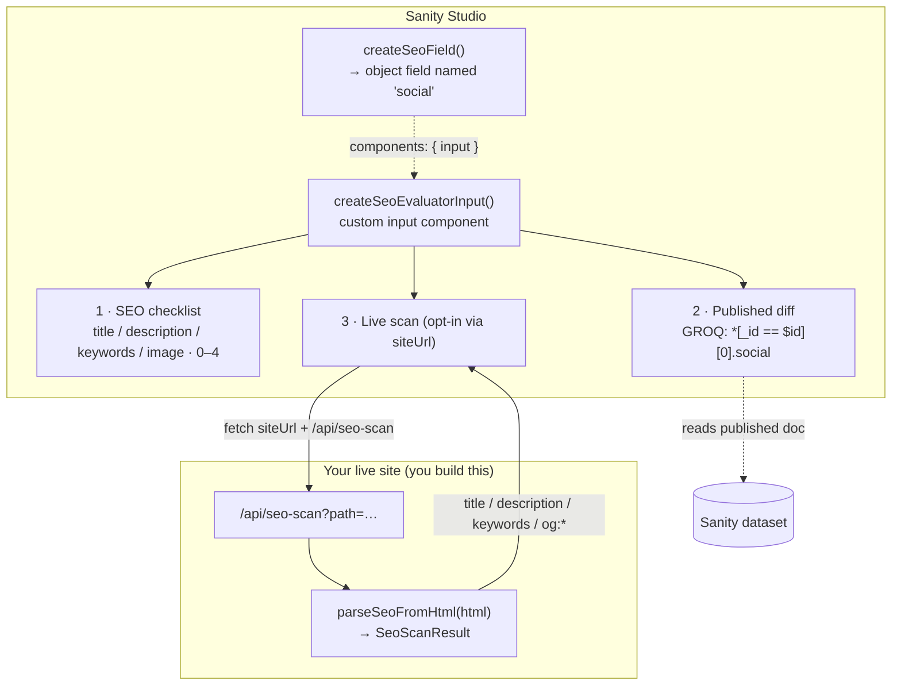

# sanity-typeface-seo

[](https://www.npmjs.com/package/@overpunch/sanity-typeface-seo)
[](https://github.com/Liiift-Studio/sanity-typeface-seo)
[](#peer-dependencies)
[](#verification-status)

Standalone Sanity SEO field definitions for typeface documents. Provides a shared social/SEO object, a visual SEO score evaluator, and optional marketplace link fields — reusable across any foundry studio.

**What you get:**

- A configurable **SEO/social schema field** (`title`, `keywords`, social `image`, `description`, plus optional canonical / noIndex / marketplace links).
- A **custom Studio input** that overlays the field editor with a live quality checklist, a draft-vs-published diff, and an optional live-site meta-tag scan.
- A framework-agnostic **`parseSeoFromHtml`** helper for building the scan endpoint the evaluator calls.

> **Heads up before you install:** the social image field is typed `cloudinary.asset`, so the [`sanity-plugin-cloudinary`](https://www.npmjs.com/package/sanity-plugin-cloudinary) plugin must be registered in your `sanity.config`, or the schema will fail to compile. See [Requirements](#requirements).

## How it works

The package ships schema fields and a Studio input. The "Live scan" panel is the only part that reaches outside the Studio — it `fetch`es a `/api/seo-scan` route **you** host on your live site, which uses the exported `parseSeoFromHtml` helper to return the rendered page's real meta tags for comparison against your draft.



## Install

```bash
npm install @overpunch/sanity-typeface-seo
```

## Usage

### Drop-in field

`seoField` is `createSeoField()` with defaults. It produces an object field **named `social`** (collapsible) — keep that name, because the evaluator's published-diff reads `social` from your dataset.

```typescript
import { defineType, defineField } from 'sanity'
import { seoField } from '@overpunch/sanity-typeface-seo'
// Or, with marketplace links (Adobe Fonts, Font Stand):
import { seoFieldWithLinks } from '@overpunch/sanity-typeface-seo'

export const typefaceSchema = defineType({
	name: 'typeface',
	type: 'document',
	fields: [
		defineField({ name: 'name', type: 'string' }),
		seoField, // adds an object field named 'social'
	],
})
```

### Custom field with `createSeoField`

`createSeoField(options)` returns a Sanity object field definition. Every option is off by default except `title`:

```typescript
import { createSeoField } from '@overpunch/sanity-typeface-seo'

const customSeoField = createSeoField({
	title: true,            // per-page title field (default: true)
	canonical: true,        // canonical URL override field (default: false)
	noIndex: true,          // "hide from search engines" toggle (default: false)
	marketplaceLinks: true, // Adobe Fonts + Font Stand link fields (default: false)
})
```

| Option | Default | Adds |
|---|---|---|
| `title` | `true` | Per-page `title` string field |
| `canonical` | `false` | `canonical` URL field |
| `noIndex` | `false` | `noIndex` boolean (emits `noindex, nofollow`) |
| `marketplaceLinks` | `false` | `adobeLink` + `fontStandLink` string fields |
| `sanityImage` | `false` | `sanityImage` — an ordinary Sanity `image` (hotspot on). The Cloudinary `image` becomes a legacy field, shown only where it already has a value |

The field always includes `keywords` (string), `image` (`cloudinary.asset`), and `description` (text).

#### A Sanity share image (that can still come from Cloudinary)

`image` is a `cloudinary.asset`. A studio whose artwork already lives in the Sanity media library can
pass `sanityImage: true` to make the share image an ordinary Sanity `image` field, `sanityImage`.

There is no source select, because a Sanity image input already has one: its **Select** menu lists
every asset source the Studio registers — upload, the media library, and Cloudinary when
`cloudinaryAssetSourcePlugin()` from `sanity-plugin-cloudinary` is installed. That source copies the
picked file into Sanity and stores it as a normal `sanity.imageAsset`, so whichever way the editor
picks, the value is a Sanity image: crop, hotspot and sizing all work the same.

The Cloudinary `image` field cannot be retyped — other studios use it, and existing values must keep
validating — so it stays in the schema as a **legacy fallback**, titled "Image (legacy Cloudinary)".
It is visible only on documents that already hold a value, and never offered on the rest. To retire
one, pick the image in the field above, then clear the legacy one.

On the consuming site, project both and read the Sanity image first:

```groq
social{
	...,
	sanityImage,                       // keep crop + hotspot for @sanity/image-url
	"image": image{ secure_url, url }  // Cloudinary: NOT image.asset-> (it has no asset ref)
}
```

```js
const shareImage = social?.sanityImage?.asset
	? urlFor(social.sanityImage).width(1200).height(630).fit('crop').url()
	: social?.image?.secure_url
```

`hasSeoImage(value)` and `resolveSeoImageSource(value, fallback?)` are exported for the same
either-field check. The evaluator uses `hasSeoImage`, so its "Social image" row is satisfied by
whichever field holds an image.

> **1.6.0 only:** that release used an `imageSource` radio ("Sanity" / "Cloudinary") with one
> visible input instead. 1.7.0 removes it, along with the `defaultImageSource` option and the
> `SEO_IMAGE_SOURCES` export. A document saved under 1.6.0 may carry a stray `imageSource` string;
> it is ignored, and the Studio will flag it as an unknown field until it is unset.

### SEO evaluator component

`createSeoEvaluatorInput(options)` returns a Sanity `input` component. Attach it via `components.input` on the **same object field** — and keep the field named `social` so the published-diff query resolves:

```typescript
import { defineField } from 'sanity'
import { createSeoField, createSeoEvaluatorInput } from '@overpunch/sanity-typeface-seo'

const SeoEvaluatorInput = createSeoEvaluatorInput({
	siteUrl: 'https://dardenstudio.com',        // enables the Live scan tab
	urlFromSlug: (slug) => `/typefaces/${slug}`, // default shown
	slugPath: ['slug', 'current'],               // default shown
})

// Attach to the field produced by createSeoField (name stays 'social'):
const seoBlock = createSeoField({ canonical: true, noIndex: true })
export const seoFieldWithEvaluator = defineField({
	...seoBlock,
	components: { input: SeoEvaluatorInput },
})
```

`createSeoEvaluatorInput` accepts **only** `SeoEvaluatorOptions` (`siteUrl`, `urlFromSlug`, `slugPath`) — the schema flags (`canonical`, `noIndex`, `marketplaceLinks`) belong to `createSeoField`, not here. A ready-made no-scan instance is also exported as `SeoEvaluatorInput`.

**Evaluator panels:**

1. **SEO checklist** — scores title length (50–60 optimal), description length (150–160 optimal), keywords presence, and social image (0–4, with green / orange / red indicators).
2. **Published diff** — compares the current draft against the published Sanity document (reads `*[_id == $id][0].social`) before publishing.
3. **Live scan** *(opt-in)* — appears only when `siteUrl` is set; fetches your live page's rendered meta tags and diffs them against the draft. Requires the scan endpoint below.

<!-- TODO(maintainer): capture a screenshot of the evaluator in the running Studio (the three panels with the green/orange/red checklist) and drop it at assets/evaluator-panel.png. Studio UI can't be captured headlessly. Then uncomment:

-->

### Live scan endpoint (`parseSeoFromHtml`)

The Live scan panel calls `GET {siteUrl}/api/seo-scan?path=<page-path>` and expects a JSON `SeoScanResult`. Your site hosts that route; the package gives you `parseSeoFromHtml` to extract the tags from the fetched HTML. Example as a Next.js route handler:

```typescript
// app/api/seo-scan/route.ts (or pages/api/seo-scan.ts)
import { parseSeoFromHtml } from '@overpunch/sanity-typeface-seo'

export async function GET(req: Request) {
	const path = new URL(req.url).searchParams.get('path') ?? '/'
	const html = await fetch(new URL(path, req.url)).then((r) => r.text())
	return Response.json(parseSeoFromHtml(html))
}
```

`parseSeoFromHtml(html)` is pure and dependency-free (regex-based) — safe to call in any Node.js context. It returns:

```typescript
type SeoScanResult = {
	title: string | null
	description: string | null
	keywords: string | null
	ogTitle: string | null
	ogDescription: string | null
	ogImage: string | null
}
```

## API

| Export | Kind | Purpose |
|---|---|---|
| `seoField` | field | `createSeoField()` with defaults (object named `social`) |
| `seoFieldWithLinks` | field | `createSeoField({ marketplaceLinks: true })` |
| `createSeoField(options)` | factory | Build a configurable SEO object field |
| `SeoEvaluatorInput` | component | `createSeoEvaluatorInput()` with no live scan |
| `createSeoEvaluatorInput(options)` | factory | Build the evaluator input (enable scan via `siteUrl`) |
| `parseSeoFromHtml(html)` | function | Extract meta tags from HTML for the scan endpoint |
| `CreateSeoFieldOptions`, `SeoEvaluatorOptions`, `SeoValue`, `SeoScanResult` | types | Exported TypeScript types |

## Requirements

| Requirement | Notes |
|---|---|
| `sanity-plugin-cloudinary` | **Required** — the social `image` field is typed `cloudinary.asset`; register the plugin in `sanity.config` or the schema won't compile. |
| `/api/seo-scan` route on your site | Only needed for the Live scan panel; build it with `parseSeoFromHtml` (see above). |
| Field named `social` | The evaluator's published-diff GROQ reads `social`; keep the field name. |

### Peer Dependencies

| Package | Declared range | Majors supported |
|---|---|---|
| `sanity` | `>=3 <7` | Studio **v3 · v4 · v5 · v6** |
| `@sanity/ui` | `>=2 <5` | v2 · v3 · v4 |
| `react` | `>=18` | 18 · 19 |

The package also carries one runtime dependency, [`@overpunch/sanity-ui-compat`](https://www.npmjs.com/package/@overpunch/sanity-ui-compat), which is what makes the four-major span possible (below).

#### Why `@sanity/ui` stops at `<5` when `sanity` goes to `<7`

Not a typo: **Studio v6 ships `@sanity/ui` v4, not v5.** The `@sanity/ui` cap tracks that library's own major, which lags the Studio's — so `>=2 <5` is exactly right for a package supporting Studio v3 through v6.

#### How one build spans four Studio majors

`@sanity/ui` v4 moved `Tooltip`, `Menu`, `MenuButton`, `MenuItem`, `Code`, `Popover`, `Autocomplete`, `Toast` and `useToast` to subpath entries, and `@sanity/icons` v5 removed every named `*Icon` export. Critically, **both packages still _declare_ the removed names in their `.d.ts` files, typed `never`** — so a named import type-checks, builds, and is `undefined` at runtime.

The evaluator input therefore imports **no `@sanity/ui` symbol directly**; everything routes through the compat layer, which resolves the installed namespace at runtime:

```typescript
import { Box, Button, Card, Flex, Spinner, Stack, Text } from '@overpunch/sanity-ui-compat'
```

If you fork or patch this package, keep it that way — direct named imports reintroduce a failure that no build step will catch.

### Verification status

- ✅ `npm test` — **12 tests passing** (vitest), covering the schema field factory.
- ✅ `npm run build` (tsup → ESM + CJS + types) succeeds.
- ✅ Running in three in-house Studios (Darden, TDF, MCKL).
- ❌ **Not** exercised in a running Sanity v6 Studio beyond those. v6 support rests on the declared peer ranges and the compat layer rather than a certified v6 test pass.

## License

MIT © Liiift Studio. See the [repository](https://github.com/Liiift-Studio/sanity-typeface-seo).
